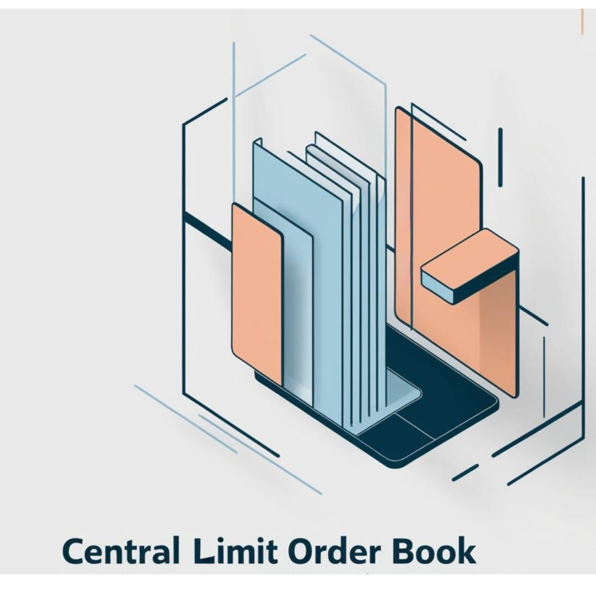

# CLOB VM
<br>



<br>

This repo contrais an amateurism attempt to make a central limit order book using hyper SDK for avalanche(i mean cant be done in 6 hrs :/ )


# Centralized Limit Order Book (CLOB) Implementation in HyperSDK


This project implements a Centralized Limit Order Book (CLOB) in Go, designed to efficiently process and match buy and sell orders in a trading system. The implementation focuses on clean code organization, efficient data structures, and clear separation of concerns.

This README provides a detailed explanation of the approach, code organization, data structures used, and the workflow for processing orders. Accompanying mermaid diagrams illustrate the interactions between components and the flow of order processing.

---

## Project Structure

The code is organized into a package named `CLOB`, with the following files:

```
orderbook/
├── order.go
├── order_queue.go
├── price_level.go
├── heap.go
├── order_book_side.go
├── order_book.go
├── matching_engine.go
├── utils.go
```

Each file serves a specific purpose, ensuring modularity and maintainability.


## Components and File Contents

### 1. `order.go`

**Purpose:** Defines the `Order` struct and related types.

```go
// orderbook/order.go
package orderbook

import "time"

// Side represents the side of an order: Buy or Sell
type Side string

const (
    Buy  Side = "buy"
    Sell Side = "sell"
)

// OrderType represents the type of an order: Limit or Market
type OrderType string

const (
    Limit  OrderType = "limit"
    Market OrderType = "market"
)

// Order represents an individual order in the order book
type Order struct {
    ID        string
    Side      Side
    Price     float64 // 0 for market orders
    Quantity  float64
    Timestamp time.Time
    OrderType OrderType
    next      *Order // For linked list (unexported)
    prev      *Order // For linked list (unexported)
}
```

**Explanation:**

- `Side`: Enumerated type indicating buy or sell.
- `OrderType`: Enumerated type indicating limit or market order.
- `Order`: Struct representing an order, including fields for order ID, side, price, quantity, timestamp, and order type.
- `next` and `prev`: Unexported fields used internally for linked list implementation.

---

### 2. `order_queue.go`

**Purpose:** Implements a doubly linked list (`OrderQueue`) to manage orders at the same price level.

```go
// orderbook/order_queue.go
package orderbook

// OrderQueue represents a doubly linked list of orders
type OrderQueue struct {
    head *Order 
    tail *Order 
    Size int
}

// NewOrderQueue creates a new empty order queue
func NewOrderQueue() *OrderQueue {
    return &OrderQueue{}
}

// Enqueue adds an order to the end of the queue
func (oq *OrderQueue) Enqueue(order *Order) {
    if oq.tail == nil {
        oq.head = order
        oq.tail = order
    } else {
        oq.tail.next = order
        order.prev = oq.tail
        oq.tail = order
    }
    oq.Size++
}

// Dequeue removes and returns the order from the front of the queue
func (oq *OrderQueue) Dequeue() *Order {
    if oq.head == nil {
        return nil
    }
    order := oq.head
    oq.head = oq.head.next
    if oq.head != nil {
        oq.head.prev = nil
    } else {
        oq.tail = nil
    }
    order.next = nil
    oq.Size--
    return order
}

// Remove removes a specific order from the queue
func (oq *OrderQueue) Remove(order *Order) {
    if order.prev != nil {
        order.prev.next = order.next
    } else {
        oq.head = order.next
    }
    if order.next != nil {
        order.next.prev = order.prev
    } else {
        oq.tail = order.prev
    }
    order.next = nil
    order.prev = nil
    oq.Size--
}
```

**Explanation:**

- `OrderQueue`: Manages orders in a FIFO manner at a specific price level.
- Methods `Enqueue`, `Dequeue`, and `Remove` manage the linked list operations.

---

### 3. `price_level.go`

**Purpose:** Defines the `PriceLevel` struct, representing all orders at a specific price.

```go
// orderbook/price_level.go
package orderbook

// PriceLevel represents a level in the order book at a specific price
type PriceLevel struct {
    Price  float64
    Orders *OrderQueue
}
```

**Explanation:**

- `PriceLevel`: Contains the price and a pointer to an `OrderQueue` of orders at that price.

---

### 4. `heap.go`

**Purpose:** Implements heap interfaces (`BuyHeap` and `SellHeap`) for managing price levels in a priority queue.

```go
// orderbook/heap.go
package orderbook

import "container/heap"

// BuyHeap implements heap.Interface for a max-heap (buy side)
type BuyHeap []*PriceLevel

func (bh BuyHeap) Len() int           { return len(bh) }
func (bh BuyHeap) Swap(i, j int)      { bh[i], bh[j] = bh[j], bh[i] }
func (bh BuyHeap) Less(i, j int) bool { return bh[i].Price > bh[j].Price }
func (bh *BuyHeap) Push(x interface{}) {
    *bh = append(*bh, x.(*PriceLevel))
}
func (bh *BuyHeap) Pop() interface{} {
    old := *bh
    n := len(old)
    x := old[n-1]
    *bh = old[0 : n-1]
    return x
}

// SellHeap implements heap.Interface for a min-heap (sell side)
type SellHeap []*PriceLevel

func (sh SellHeap) Len() int           { return len(sh) }
func (sh SellHeap) Swap(i, j int)      { sh[i], sh[j] = sh[j], sh[i] }
func (sh SellHeap) Less(i, j int) bool { return sh[i].Price < sh[j].Price }
func (sh *SellHeap) Push(x interface{}) {
    *sh = append(*sh, x.(*PriceLevel))
}
func (sh *SellHeap) Pop() interface{} {
    old := *sh
    n := len(old)
    x := old[n-1]
    *sh = old[0 : n-1]
    return x
}
```

**Explanation:**

- `BuyHeap`: Max-heap for buy orders, prioritizing higher prices.
- `SellHeap`: Min-heap for sell orders, prioritizing lower prices.
- Both implement the `heap.Interface` for use with Go's `container/heap` package.

---

### 5. `order_book_side.go`

**Purpose:** Manages one side of the order book (`OrderBookSide`), either buy or sell.

```go
// orderbook/order_book_side.go
package orderbook

import "container/heap"

// OrderBookSide represents one side of the order book (buy or sell)
type OrderBookSide struct {
    Side        Side
    PriceLevels map[float64]*PriceLevel
    Prices      heap.Interface
}

// NewOrderBookSide creates a new OrderBookSide
func NewOrderBookSide(side Side) *OrderBookSide {
    obSide := &OrderBookSide{
        Side:        side,
        PriceLevels: make(map[float64]*PriceLevel),
    }
    if side == Buy {
        bh := &BuyHeap{}
        heap.Init(bh)
        obSide.Prices = bh
    } else {
        sh := &SellHeap{}
        heap.Init(sh)
        obSide.Prices = sh
    }
    return obSide
}

// AddPriceLevel adds a new price level to the heap
func (obs *OrderBookSide) AddPriceLevel(priceLevel *PriceLevel) {
    heap.Push(obs.Prices, priceLevel)
}

// RemovePriceLevel removes a price level from the heap
// Note: Direct removal from heap middle is complex; additional logic required
func (obs *OrderBookSide) RemovePriceLevel(priceLevel *PriceLevel) {
    // Placeholder for removal logic
}

// PeekBestPriceLevel returns the best price level without removing it
func (obs *OrderBookSide) PeekBestPriceLevel() *PriceLevel {
    if obs.Prices.Len() == 0 {
        return nil
    }
    return (*obs.Prices).([]*PriceLevel)[0]
}
```

**Explanation:**

- `OrderBookSide`: Contains the side (buy/sell), a map of price levels, and a heap of prices.
- `NewOrderBookSide`: Initializes the side with the appropriate heap.
- Methods manage adding and removing price levels.

---

### 6. `order_book.go`

**Purpose:** Defines the `OrderBook` struct, which contains both sides and a map of all orders.

```go
// orderbook/order_book.go
package orderbook

// OrderBook represents the entire order book
type OrderBook struct {
    Bids     *OrderBookSide
    Asks     *OrderBookSide
    OrderMap map[string]*Order
}

// NewOrderBook creates a new OrderBook
func NewOrderBook() *OrderBook {
    return &OrderBook{
        Bids:     NewOrderBookSide(Buy),
        Asks:     NewOrderBookSide(Sell),
        OrderMap: make(map[string]*Order),
    }
}
```

**Explanation:**

- `OrderBook`: Contains `Bids`, `Asks`, and `OrderMap`.
- `NewOrderBook`: Initializes a new order book.

---

### 7. `matching_engine.go`

**Purpose:** Implements the matching engine logic to process and match orders.

```go
// orderbook/matching_engine.go
package orderbook

import (
    "container/heap"
    "fmt"
)

// AddOrder processes and adds an order to the order book
func (ob *OrderBook) AddOrder(order *Order) error {
    // Add order to OrderMap
    ob.OrderMap[order.ID] = order

    // Process order based on type
    switch order.OrderType {
    case Limit:
        return ob.matchLimitOrder(order)
    case Market:
        return ob.matchMarketOrder(order)
    default:
        return fmt.Errorf("unknown order type: %v", order.OrderType)
    }
}

// matchMarketOrder processes a market order
func (ob *OrderBook) matchMarketOrder(order *Order) error {
    oppositeSide := ob.getOppositeSide(order.Side)
    remainingQty := order.Quantity

    for remainingQty > 0 && oppositeSide.Prices.Len() > 0 {
        // Get the best price level
        bestPriceLevel := heap.Pop(oppositeSide.Prices).(*PriceLevel)
        ordersQueue := bestPriceLevel.Orders

        for ordersQueue.Size > 0 && remainingQty > 0 {
            headOrder := ordersQueue.Dequeue()
            tradeQty := min(remainingQty, headOrder.Quantity)
            // Execute trade (log trade details)
            settleTrade(order, headOrder, tradeQty)
            remainingQty -= tradeQty
            headOrder.Quantity -= tradeQty

            if headOrder.Quantity == 0 {
                // Remove order from OrderMap
                delete(ob.OrderMap, headOrder.ID)
            } else {
                // Re-enqueue the remaining quantity
                ordersQueue.Enqueue(headOrder)
                break
            }
        }

        if ordersQueue.Size == 0 {
            // No more orders at this price level
            delete(oppositeSide.PriceLevels, bestPriceLevel.Price)
        } else {
            // Push back the price level as there are still orders left
            heap.Push(oppositeSide.Prices, bestPriceLevel)
        }
    }

    if remainingQty > 0 {
        // Market order could not be fully matched
        return fmt.Errorf("market order could not be fully matched")
    }

    // Order fully processed
    delete(ob.OrderMap, order.ID)
    return nil
}

// matchLimitOrder processes a limit order
func (ob *OrderBook) matchLimitOrder(order *Order) error {
    oppositeSide := ob.getOppositeSide(order.Side)
    compare := getPriceComparator(order.Side)
    remainingQty := order.Quantity

    for remainingQty > 0 && oppositeSide.Prices.Len() > 0 {
        bestPriceLevel := oppositeSide.PeekBestPriceLevel()

        // Check if the price satisfies the limit order's condition
        if compare(bestPriceLevel.Price, order.Price) {
            heap.Pop(oppositeSide.Prices)
            ordersQueue := bestPriceLevel.Orders

            for ordersQueue.Size > 0 && remainingQty > 0 {
                headOrder := ordersQueue.Dequeue()
                tradeQty := min(remainingQty, headOrder.Quantity)
                // Execute trade (log trade details)
                settleTrade(order, headOrder, tradeQty)
                remainingQty -= tradeQty
                headOrder.Quantity -= tradeQty

                if headOrder.Quantity == 0 {
                    // Remove order from OrderMap
                    delete(ob.OrderMap, headOrder.ID)
                } else {
                    // Re-enqueue the remaining quantity
                    ordersQueue.Enqueue(headOrder)
                    break
                }
            }

            if ordersQueue.Size == 0 {
                // No more orders at this price level
                delete(oppositeSide.PriceLevels, bestPriceLevel.Price)
            } else {
                // Push back the price level as there are still orders left
                heap.Push(oppositeSide.Prices, bestPriceLevel)
            }
        } else {
            // Price doesn't satisfy the limit order condition
            break
        }
    }

    if remainingQty > 0 {
        // Add the remaining order to the book
        order.Quantity = remainingQty
        side := ob.getSide(order.Side)
        ob.addLimitOrder(side, order)
    } else {
        // Order fully filled
        delete(ob.OrderMap, order.ID)
    }
    return nil
}

// addLimitOrder adds a limit order to the appropriate side
func (ob *OrderBook) addLimitOrder(side *OrderBookSide, order *Order) {
    priceLevel, exists := side.PriceLevels[order.Price]
    if !exists {
        // Create new price level
        priceLevel = &PriceLevel{
            Price:  order.Price,
            Orders: NewOrderQueue(),
        }
        // Add to PriceLevels map
        side.PriceLevels[order.Price] = priceLevel
        // Add price level to heap
        side.AddPriceLevel(priceLevel)
    }
    // Enqueue order
    priceLevel.Orders.Enqueue(order)
}

// Helper methods
func (ob *OrderBook) getSide(side Side) *OrderBookSide {
    if side == Buy {
        return ob.Bids
    }
    return ob.Asks
}

func (ob *OrderBook) getOppositeSide(side Side) *OrderBookSide {
    if side == Buy {
        return ob.Asks
    }
    return ob.Bids
}
```

**Explanation:**

- `AddOrder`: Entry point to process new orders.
- `matchMarketOrder`: Matches market orders against the opposite side until fulfilled.
- `matchLimitOrder`: Matches limit orders considering the price limit.
- `addLimitOrder`: Adds unmatched limit orders to the order book.
- Helper methods for side retrieval.

---

### 8. `utils.go`

**Purpose:** Contains utility functions used across the package.

```go
// orderbook/utils.go
package orderbook

import "fmt"

// min returns the minimum of two float64 numbers
func min(a, b float64) float64 {
    if a < b {
        return a
    }
    return b
}

// settleTrade simulates the settlement of a trade between two orders
func settleTrade(order1, order2 *Order, quantity float64) {
    // Log the trade execution
    fmt.Printf("Trade executed: %s and %s for %.2f units at price %.2f\n",
        order1.ID, order2.ID, quantity, order2.Price)
}

// getPriceComparator returns a comparison function based on the side
func getPriceComparator(side Side) func(float64, float64) bool {
    if side == Buy {
        return func(a, b float64) bool { return a <= b }
    }
    return func(a, b float64) bool { return a >= b }
}
```

**Explanation:**

- `min`: Utility to find the minimum of two values.
- `settleTrade`: Simulates trade execution (can be expanded for real settlement).
- `getPriceComparator`: Returns a comparison function based on the order side.

---

## Order Processing Workflow

### 1. Receiving an Order

- An order is created and passed to the `AddOrder` method of the `OrderBook`.
- The order is added to the `OrderMap` for tracking.

### 2. Processing a Market Order

**Objective:** Execute immediately against the best available prices.

**Workflow:**

1. Identify the opposite side (`Asks` for a buy order, `Bids` for a sell order).
2. While the order is not fully matched and there are price levels:
   - Get the best price level from the heap.
   - Iterate through orders in the `OrderQueue` at that price level.
   - Execute trades, updating quantities.
   - Remove fully matched orders from the queue and `OrderMap`.
3. If the order is fully matched, remove it from the `OrderMap`.
4. If not fully matched, return an error indicating partial fill.

**Mermaid Diagram:**


### 3. Processing a Limit Order

**Objective:** Match within the limit price; otherwise, add to the order book.

**Workflow:**

1. Identify the opposite side.
2. While the order is not fully matched and there are price levels satisfying the limit price:
   - Peek at the best price level.
   - If the price satisfies the limit condition, proceed to match.
   - Iterate through orders in the `OrderQueue` at that price level.
   - Execute trades, updating quantities.
   - Remove fully matched orders from the queue and `OrderMap`.
3. If the order is not fully matched, add it to the order book on the appropriate side.

**Mermaid Diagram:**


---

## Interaction Between Components

**Mermaid Class Diagram:**


<br>
<br> 


# Configuration Tuning for Enhanced Prediction Market Performance

To optimize the performance, scalability, and reliability of the prediction market, we fine-tune the HyperSDK VM using the `Config` struct. Adjusting these configuration parameters allows us to simulate realistic trading environments, manage transaction loads efficiently, and ensure smooth operation under varying conditions.

## Configuration Parameters

```go
type Config struct {
    uris             []string
    authFactory      chain.AuthFactory
    sZipf            float64
    vZipf            float64
    txsPerSecond     int
    minTxsPerSecond  int
    txsPerSecondStep int
    numClients       int
    numAccounts      int
}
```
further im storing all these in the state db throughuse of Hypersdk
to make the stuff faster

it was hard to get this to work in 6hrs  so this is just a proof of concept 
given enough time ,would love to work with this toolkit and get this to work 